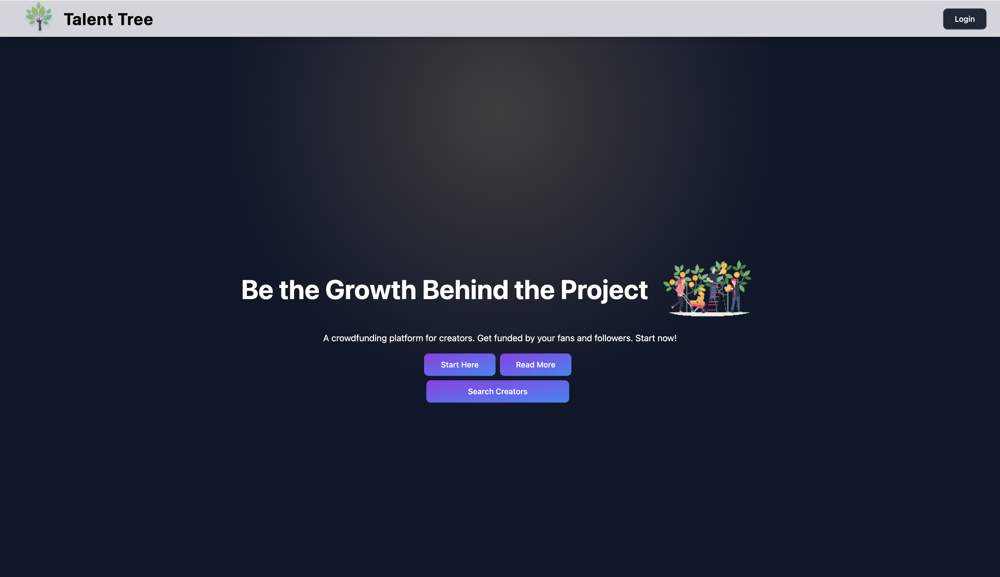
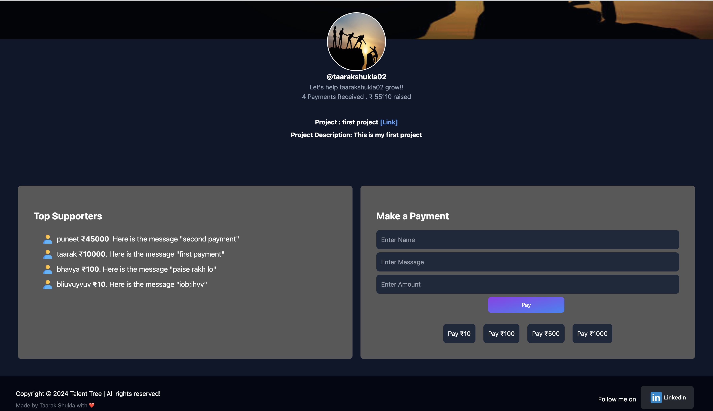

# Talent Tree


## Project Description
Talent Tree is a crowdfunding platform developed using Next.js (App Route), React, MongoDB, and Node.js. It is a space for developers, creators, and innovators to raise funds for their projects. By creating a Razorpay account, project creators can securely receive funds directly into their accounts.  

The platform enables creators to showcase their projects with detailed descriptions and links, helping potential backers make informed decisions. Talent Tree is designed to connect visionaries with a supportive community to help bring their ideas to life.

## Tech Stack

1. **Next.js with TailwindCSS**  
2. **MongoDB**  
3. **Node.js**

## Features

- **User-Friendly Interface**: Intuitive design that simplifies project creation and funding.  
- **Secure Payments**: Razorpay integration ensures fast, reliable, and secure transactions.  
- **Diverse Projects**: Support various types of projects, from small-scale ideas to large ventures.  
- **Community Support**: There are no fees for using the platform. Both developers seeking funds and supporters looking to contribute can use the platform without any cost. 
- **Real-Time Analytics**: Track fundraising progress and contributions. 

## Screenshots




## Environment Variables

To run this project, you will need to add the following environment variables to your .env.local file
```
NEXT_PUBLIC_URL=http://localhost:3000
MONGODB_URI="mongodb://localhost:27017/talent-tree"
NEXTAUTH_URL=http://localhost:3000
NEXTAUTH_SECRET=<a secret>
GITHUB_ID=<your github id>
GITHUB_SECRET=<your github secret>
GOOGLE_ID=<your google id>
GOOGLE_SECRET=<your google secret>
```
To know how to get these Client ID and Client Secret, see https://next-auth.js.org/providers

## Installation

To install this project into your local machine run this command

Clone the repository:
   ```bash
    git clone https://github.com/taarakshukla/Talent-Tree.git
```
## Run Locally
Go into the folder you have installed this project and proceed with following procedure

1. Install dependencies

```bash
  npm install
```

2. Create a Razorpay account and obtain your Razorpay ID and secret for testing.

3. Create a .env.local file in the root directory (as motioned above).

4. Run the development server:
```bash
  npm run dev
```
5. Open your browser and navigate to http://localhost:3000.

## Usage/Examples

#### For Project Creators or Developers:

1. **Sign-In** - Users will sign up through Google or GitHub (credential login is not supported, users use NextAuth).
2. **CreateProject** - Users will be redirected to their dashboard where they need to fill in the project name, description, link, Razorpay ID, and secret.
3. **Save Profile Details** - Click the save button. If the payment details are correct, they will start receiving funds into their Razorpay account if fund givers contribute.
4. **Track Progress** -  Monitor funds raised and keep supporters updated.

#### For Supporters:
1. **Explore Projects** - To view the list of trending and featured projects, click the 'Search Creators' button on Homepage.
2. **Top Supporters** - A list of the top 10 fund raisers who received the highest funds for their projects will be displayed.
3. **Find Creators and Projects** - Use the search field to find project developers by their project, username, or developer name.
4. **Fund Projects** - Once you find a project you wish to support, click on it to view the project details, including the project name, description, and a link to the project.
5. **Support Creators** - If you decide to contribute, click on the 'Pay' button by filling required data and you will be redirected to a secure payment page powered by Razorpay.
6. **Secure Payments** - After the transaction is successful, you will receive a confirmation of your contribution, and the funds will be directly transferred to the developer's Razorpay account.

### Thank You

Thank you for choosing **Talent Tree**. We hope this platform helps bring creative ideas to life and supports developers and creators in achieving their goals.